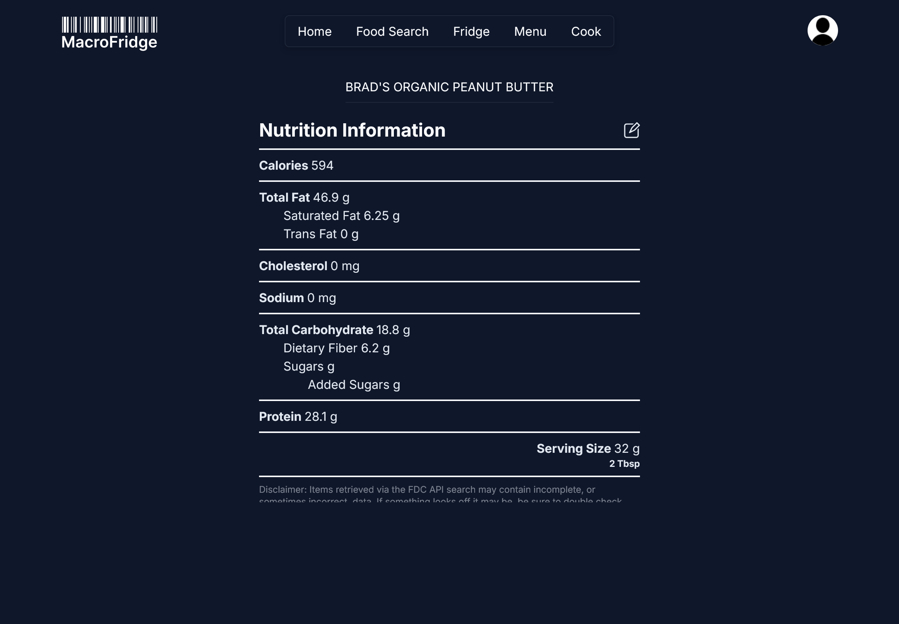

    

# Macro Fridge

**Macro Fridge** is a fully responsive web app to help keep track of your food.

    
    

## Search the USDA Food database for an item.
Query the USDA database for most items that are availibile for purchase, and view their macros.

    

## Save Items to your Fridge, Where you can view and edit the Macros.
You can save items to your digital "Fridge" and, if you need edit any macros that seem off. Or just add your own items manually.

    

    

## Craft Meals
Combine items in your "Fridge" to Make a "Meal", nutrient information is automatically calculated based on the percentage of serving portion provided by the user.

    

