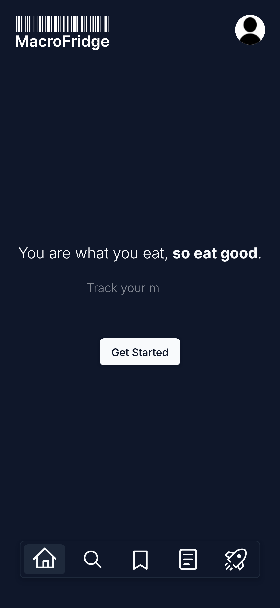
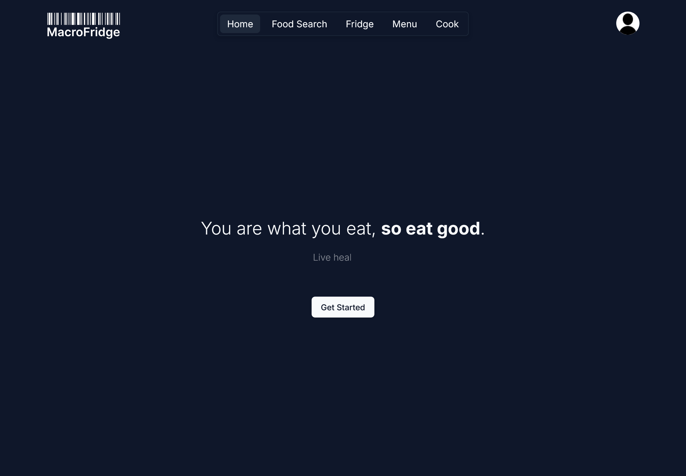
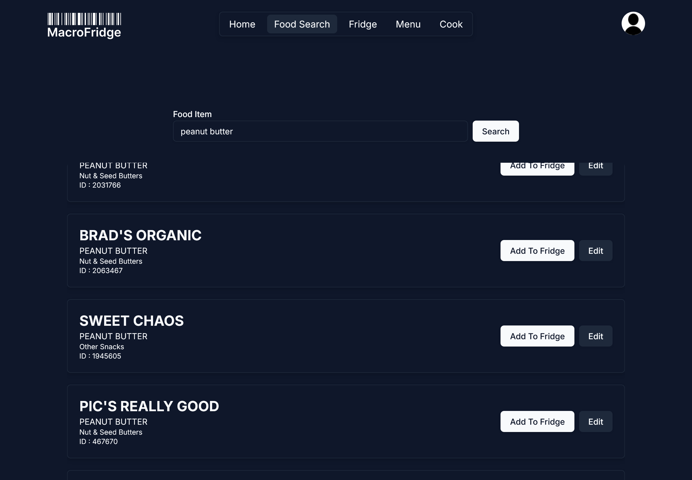
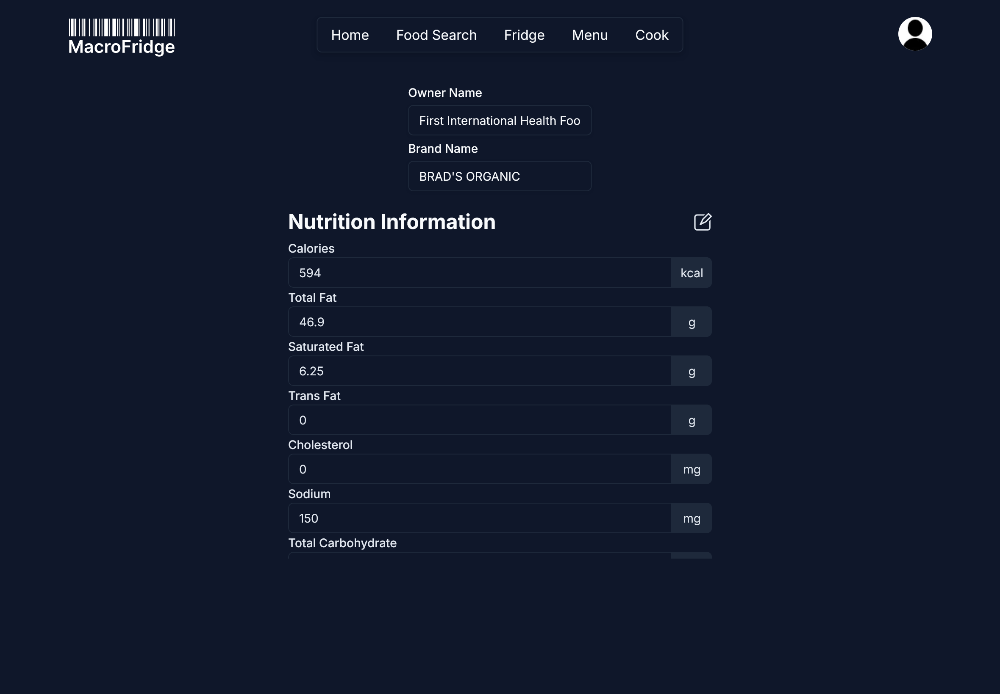
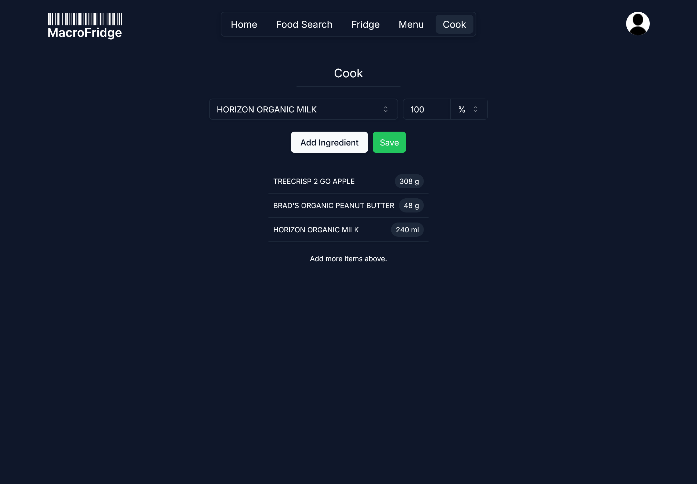

# Macro Fridge

A fully responsive web app to help keep track of your food.

    
    

## Search the USDA Food database for an item.

    

## Save Items to your Fridge, Where you can edit the Macros.

    

## Combine Items in Your Fridge to Make a "Meal", nutrient information is automatically calculated.

    

